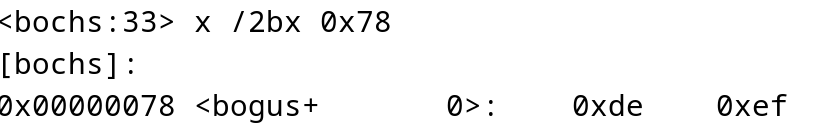
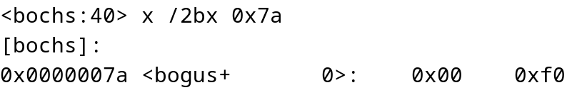
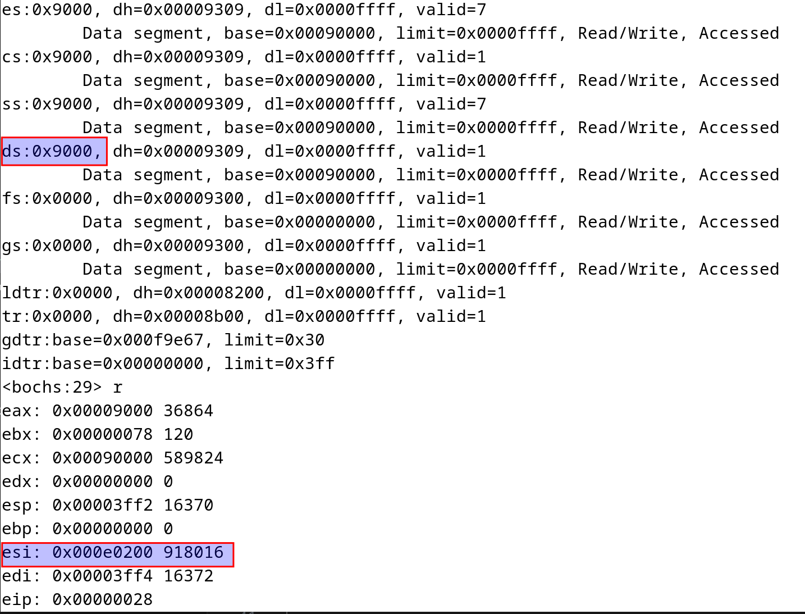
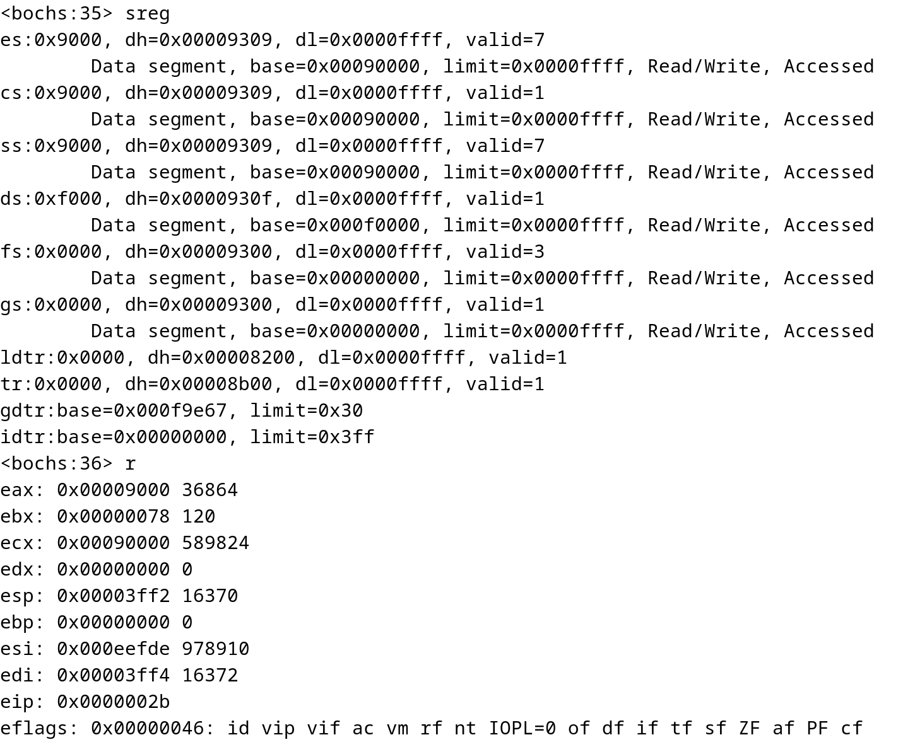
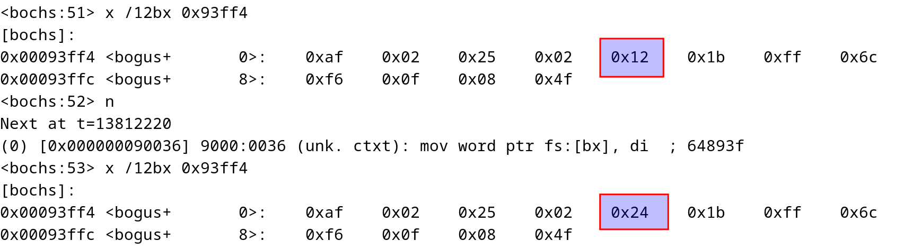

[toc]

**bootsect分析**

# bootsect 总体流程

bootsect 编译后大小为 512 字节，放置在MBR中，bootsect 被 BIOS 加载到 0x7c00 位置处，然后将自己移动到 0x90000 处, 然后再从磁盘中读取4扇区的setup代码放置在0x90200处，最后将system代码读取放置在 0x10000 处

```asm
.global _start      # 入口
_start:
	movw	$BOOTSEG, %ax       # 0x7c00
	movw	%ax, %ds
	movw	$INITSEG, %ax       # 0x9000
	movw	%ax, %es
	movw	$256, %cx           # 256 World, 512 Byte
	subw	%si, %si
	subw	%di, %di
	cld
	rep
	movsw                       # 将自己移动到0x90000处
	ljmp	$INITSEG, $go       # 远跳 CS=$INITSEG,IP=$go
go:	movw	$0x4000-12, %di		# 0x3ff4 栈顶
	movw	%ax, %ds		# ax and es already contain INITSEG
	movw	%ax, %ss
	movw	%di, %sp		# put stack at INITSEG:0x3ff4. SS:SP=INITSEG:0x3ff4

# 修改软盘参数: 每磁道最大扇区
    movw	%cx, %fs		# fs = 0
	movw	$0x78, %bx		# fs:bx指向的地址的值是软盘参数表的地址
	pushw	%ds
	ldsw	%fs:(%bx), %si		# ds:si is source 将%fs:(%bs)指向的地址(0x00:0x78)的值(2byte)放到%si中,并将%fs:2(%bx)地址指向的值放置在%ds中
```




从上面的图片可以看出，在运行**ldsw**命令前,0x78内存开始的4字节内容为:0xde,0xef,0x00,0xf0
si和ds的值分别为:0x2000,0x9000
在运行**ldsw**命令后，各寄存器的值为:

可以看出，ds的值就是0x7a,0x7b内存的值,si的值就是0x78,0x79的值
现在DS:SI指向的内存地址就是软盘参数表
所以从0x78开始的4个值，指向的就是软盘参数列表
下面会拷贝此表的参数到sp处，并修改其中的**每磁道最大扇区**，然后修改0x78后4字节的值，指向新的软盘参数地址

```asm
	movb	$6, %cl			# copy 12 bytes 软盘参数地址
	pushw	%di			# di = 0x4000-12. 将%si指向内存的地址移动到%di处
	rep				
	movsw
	popw	%di		# $0x4000-12
	popw	%ds		# INITSEG
	movb	$36, 0x4(%di)		# 修改每磁道最大扇区
	movw	%di, %fs:(%bx)      # 指向新的软盘参数表
	movw	%es, %fs:2(%bx)
```

修改前后软盘参数对比:


# 参考
[IA32体系结构4(x86常见指令概述)](https://blog.csdn.net/sunxiaohusunke/article/details/88840969)